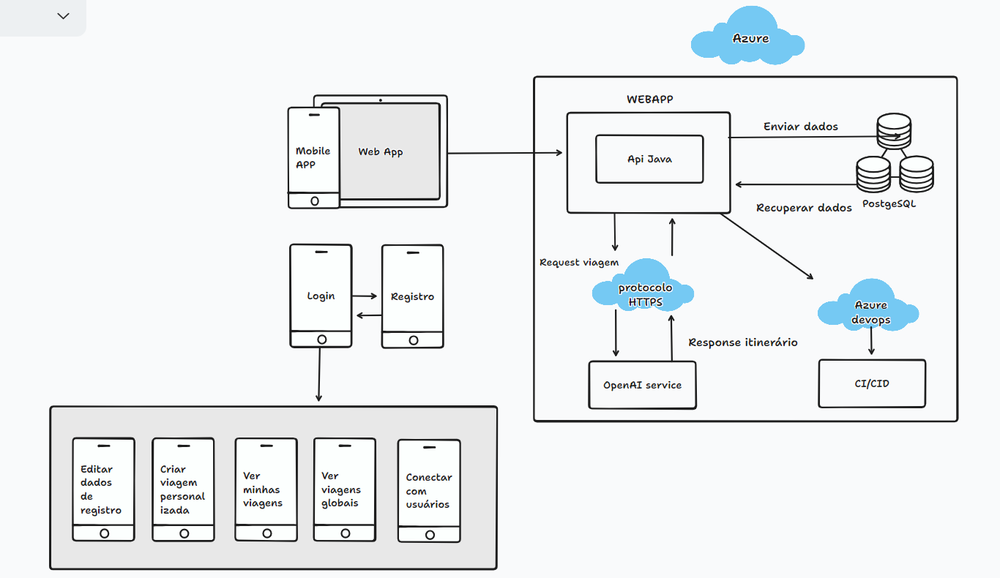

# Where2Go

## 1. Introdução

Conforme apresentado na Sprint 1, Where2Go é um aplicativo de planejamento de viagens que usa a tecnologia de IA para criar itinerários personalizados para seus usuários. A solução é construída em Java, usando o Spring Boot como framework de backend e baseada na arquitetura RESTful.

## 2. Endpoints

### 2.1 AuthController

- **Endpoint:** POST /login
- **Descrição:** Este endpoint é utilizado para autenticar o usuário.
- **Corpo da Solicitação:** O corpo da solicitação deve ser um JSON contendo o login e a senha do usuário.
  
  **Requisição:**
  ```json
  {
    "login": "neurotrix@example.com",
    "password": "teste123"
  }
  ```
  
**Resposta:** Caso a autenticação seja um sucesso, é retornado um JWT de autenticação com validade de 30 minutos.

### 2.2 TripController

- **Endpoint:** POST /trip
- **Descrição:** Este endpoint é utilizado para a aplicação gerar uma viagem de acordo com inputs de usuário.
- **Corpo da Solicitação:** O corpo da solicitação deve ser um JSON contendo a as preferencias do usuário.

 **Requisição:**
  ```json
  {
  "clima": "frio",
  "transporte": "avião",
  "tempoMaximo": 5,
  "custoMaximo": 10000.00,
  "destino":"africa do sul",
  "dataInicio": "2023-10-27",
  "dataFim": "2023-11-03"
  }
  ```

**Resposta:** Em caso de sucesso, é retornada uma viagem personalizada, exemplo:
  ```json
{
    "destino": "Rio de Janeiro",
    "pais": "Brasil",
    "atividadesPorDia": [
        {
            "dia": 1,
            "atividades": [
                {
                    "nome": "Visitar o Cristo Redentor",
                    "duracao": "2 horas"
                },
                {
                    "nome": "Passear pela praia de Copacabana",
                    "duracao": "3 horas"
                }
            ]
        },
        {
            "dia": 2,
            "atividades": [
                {
                    "nome": "Fazer um passeio de barco na Baía de Guanabara",
                    "duracao": "4 horas"
                },
                {
                    "nome": "Conhecer o Jardim Botânico",
                    "duracao": "2 horas"
                }
            ]
        },
        {
            "dia": 3,
            "atividades": [
                {
                    "nome": "Fazer uma trilha no Parque Nacional da Tijuca",
                    "duracao": "4 horas"
                },
                {
                    "nome": "Visitar o Museu do Amanhã",
                    "duracao": "3 horas"
                }
            ]
        },
        {
            "dia": 4,
            "atividades": [
                {
                    "nome": "Relaxar na praia de Ipanema",
                    "duracao": "4 horas"
                },
                {
                    "nome": "Conhecer o Pão de Açúcar",
                    "duracao": "2 horas"
                }
            ]
        },
        {
            "dia": 5,
            "atividades": [
                {
                    "nome": "Fazer um tour pela Lapa",
                    "duracao": "3 horas"
                },
                {
                    "nome": "Praticar esportes na praia da Barra da Tijuca",
                    "duracao": "4 horas"
                }
            ]
        },
        {
            "dia": 6,
            "atividades": [
                {
                    "nome": "Visitar o Maracanã",
                    "duracao": "2 horas"
                },
                {
                    "nome": "Conhecer o Museu Nacional de Belas Artes",
                    "duracao": "3 horas"
                }
            ]
        },
        {
            "dia": 7,
            "atividades": [
                {
                    "nome": "Fazer um passeio de helicóptero pela cidade",
                    "duracao": "1 hora"
                },
                {
                    "nome": "Apreciar o pôr do sol no Arpoador",
                    "duracao": "2 horas"
                }
            ]
        }
    ],
    "hospedagem": "Hotel Copacabana, Quarto Duplo",
    "duracaoViagem": "7 dias",
    "custo": 10000,
    "dataInicio": "2023-10-27",
    "dataFim": "2023-11-03"
}
  ```
- **Endpoint:** GET /message
- **Descrição:** Este endpoint é utilizado para obter todas as mensagens enviadas pelo usuário atualmente autenticado.

 **Requisição:**
  ```URL
   GET http://localhost:8080/trip/
  ```
**Resposta:** Em caso de sucesso, retorna uma lista de viagens criada para o usuário previamente com o modelo de inteligência artificial.

- **Endpoint:** DELETE /trip/{id}
- **Descrição:** Este endpoint é utilizado para deletar uma viagem específica do usuário autenticado. 
- **Parâmetros de Caminho:** ID da viagem a ser deletada.

 **Requisição:**
  ```URL
   DELETE http://localhost:8080/trip/{id}
  ```
**Resposta:** Retorna 200 OK se a mensagem for deletada com sucesso. Retorna 404 Not Found se a viagem não for encontrada.

### 2.3 UserController

- **Endpoint:** POST /user/register
- **Descrição:** Este endpoint é utilizado para registrar um novo usuário.
- **Corpo da Solicitação:** O corpo da solicitação deve ser um JSON contendo as informações do usuário (nome, login, senha, etc.).

 **Requisição:**
  ```json
{
  "name": "Felipe",
  "email": "felipe1@fiap.com",
  "password": "teste1233",
  "cpf": "45213085803",
  "cellphone": "11982769048",
  "description": "Sou um cara legal :)"
}
  ```

**Resposta:** Retorna 200 OK caso o usuário seja criado corretamente

- **Endpoint:** PUT /user/register
- **Descrição:** Este endpoint é utilizado para atualizar as informações do usuário.
- **Corpo da Solicitação:** O corpo da solicitação deve ser um JSON contendo as informações do usuário (nome, login, senha, etc.).

 **Requisição:**
  ```json
{
  "name": "Felipe",
  "email": "felipe1@fiap.com",
  "password": "teste1233",
  "cpf": "45213085803",
  "cellphone": "11982769048",
  "description": "Sou um cara legal :)"
}
  ```

**Resposta:** Retorna 200 OK caso o usuário seja editado corretamente

- **Endpoint:** GET /user/all 
- **Descrição:** Este endpoint é utilizado para obter uma lista de todos os usuários, com seus nomes e emails.

 **Requisição:**
  ```URL
   GET http://localhost:8080/user/all
  ```
  
**Resposta:** Em caso de sucesso, retorna uma lista de todos os usuários.

## 4. Arquitetura da solução

Para a autenticação do usuário, é utilizada a arquitetura de Spring Web Application com web security:

- **Autenticação:** Quando o usuário envia uma solicitação de login para o servidor, fornecendo suas credenciais (nome de usuário e senha), o backend verifica essas credenciais no banco de dados. Se as credenciais forem válidas, a aplicação irá gerar um token JWT, que é assinado e criptografado usando uma chave secreta mantida no servidor.

- **Geração do Token:** O token JWT contém informações sobre o usuário (como seu ID, nome de usuário e outras informações que podem ser úteis), bem como informações sobre a validade do token. O token é então enviado de volta ao usuário como resposta à solicitação de login.

- **Uso do Token:** Em todas as solicitações subsequentes que o usuário faz para o servidor, o token JWT deve ser incluído no cabeçalho da solicitação. Isso serve como uma "prova" de que o usuário está autenticado. É assim que o servidor "sabe" quem está fazendo a solicitação sem ter que verificar as credenciais do usuário a cada vez.

- **Verificação do Token:** Quando uma solicitação é recebida pelo servidor com um token JWT, o servidor irá validar o token - verificando se ele não expirou e se foi assinado com a chave correta. Se o token for válido, o servidor tratará a solicitação como vinda do usuário identificado no token.

- **Autorização:** Além da autenticação, o token JWT também pode ser usado para autorização. Isso significa que ele pode conter informações sobre o que o usuário tem permissão para fazer no sistema (seus roles ou permissões), e o servidor pode verificar essas informações para garantir que o usuário só tenha acesso aos recursos apropriados.

**Geração de viagens**: O sistema conta com os serviços da OpenAI para gerar viagens personalizadas para o cliente de acordo com as preferências.

- **Finalização da sessão:** Se o usuário desejar fazer logout, o cliente simplesmente descarta o token JWT. Como o servidor não mantém um registro dos tokens emitidos, não há necessidade de uma solicitação de logout para o servidor.



## 8. Conexão com a API OpenAI

A conexão com a API OpenAI é realizada utilizando a biblioteca openai-java, que permite realizar requisições POST à API, especificando o prompt, o modelo e os tokens máximos.

Exemplo da classe em JAVA :

```java
@Service
@Slf4j
public class GptService {

    @Value("${openai.api.key}")
    private String apiKey;
    private OpenAiService service;

    @PostConstruct
    public void init() {
        this.service = new OpenAiService(apiKey, Duration.ofSeconds(60));
    }

    public TripDto createOpenAiTrip(TripCreationDto tripCreationDto) {
        List<ChatMessage> messages = new ArrayList<>(List.of(
                new ChatMessage(ChatMessageRole.SYSTEM.value(), PromptConstants.TRAVEL_INITIALIZER),
                new ChatMessage(ChatMessageRole.USER.value(), PromptConstants.TRAVEL_FORMAT),
                new ChatMessage(ChatMessageRole.USER.value(), PromptConstants.OUTPUT_RULES),
                new ChatMessage(ChatMessageRole.USER.value(), PromptConstants.OUTPUT_EXAMPLE),
                new ChatMessage(ChatMessageRole.USER.value(), PromptConstants.LINE_SEPARATOR),
                new ChatMessage(ChatMessageRole.USER.value(), PromptConstants.TRAVEL_CREATOR),
                new ChatMessage(ChatMessageRole.USER.value(), PromptConstants.TRAVEL_CLIMATE + tripCreationDto.getClime()),
                new ChatMessage(ChatMessageRole.USER.value(), PromptConstants.TRAVEL_COST + tripCreationDto.getMaxCost()),
                new ChatMessage(ChatMessageRole.USER.value(), PromptConstants.TRAVEL_TRANSPORT + tripCreationDto.getTransport()),
                new ChatMessage(ChatMessageRole.USER.value(), PromptConstants.MAX_DURATION + tripCreationDto.getMaxTime()),
                new ChatMessage(ChatMessageRole.USER.value(), PromptConstants.START_DATE + tripCreationDto.getStartDate()),
                new ChatMessage(ChatMessageRole.USER.value(), PromptConstants.END_DATE + tripCreationDto.getEndDate())
        ));

        if (null != tripCreationDto.getDestino()) {
            ChatMessage destiny = new ChatMessage(ChatMessageRole.USER.value(), PromptConstants.DESTINY + tripCreationDto.getDestino());
            messages.add(destiny);
        }

        ChatCompletionRequest chatCompletionRequest = ChatCompletionRequest
                .builder()
                .model("gpt-3.5-turbo")
                .messages(messages)
                .n(1)
                .maxTokens(900)
                .build();

        String trip = this.replaceLineSeparator(service.createChatCompletion(chatCompletionRequest).getChoices().get(0).getMessage().getContent());
        log.info(trip);
        return MapperUtil.jsonToEntity(trip, TripDto.class);
    }
}
```

## 9. Pipeline de CI/CD para Aplicação Java com Azure Pipelines

### Visão Geral
Como configurar e executar a pipeline de integração contínua e entrega contínua (CI/CD) para uma aplicação Java que interage com a API da OpenAI para gerar viagens, utilizando Azure Pipelines.

### Pré-requisitos
- Conta no Azure DevOps.
- Projeto no Azure DevOps configurado com o repositório do código-fonte.
- Agente de build configurado (self-hosted ou hospedado pela Microsoft).
- Java JDK 17 instalado no agente de build.
- Acesso à API da OpenAI (chave de API).

### Configuração do Ambiente
9.1. **Configurar Variáveis de Ambiente:**
   - `SPRING_DATASOURCE_URL`: URL do banco de dados.
   - `SPRING_DATASOURCE_USERNAME`: Nome de usuário do banco de dados.
   - `SPRING_DATASOURCE_PASSWORD`: Senha do banco de dados.
   - `SPRING_JWT_SECRET`: Chave secreta para JWT.
   - `OPENAI_API_KEY`: Chave de API da OpenAI.

9.2. **Configurar Azure Web App:**
   - Crie um Web App no Azure para hospedar a aplicação.
   - O nome do Web App deve ser o mesmo que o utilizado em appName. EX: appName: 'wheretogoapplication'
   - Configure o azure subscription de acordo com o nome da sua assinataura. EX: azureSubscription: 'Azure for Students(c575404e-7d3e-4077-822b-96604bc2fd19)'.

### Executando a Pipeline
9.3. **Push ou Pull Request no Branch Master:**
   - A pipeline é acionada automaticamente em qualquer push ou pull request para o branch `master`.

9.4. **Etapas da Pipeline:**
   - **Build:**
     - Executa testes.
     - Compila o código.
     - Gera artefatos de build.
   - **Deploy:**
     - Baixa os artefatos de build.
     - Realiza o deploy no Azure Web App.

9.5. **Monitoramento:**
   - Verifique o status da pipeline no Azure DevOps.
   - Em caso de falhas, consulte os logs para diagnóstico.

### Troubleshooting
- **Falhas de Build:** Verifique os logs de build para erros de compilação ou falhas de teste.
- **Problemas de Deploy:** Certifique-se de que todas as configurações do Azure Web App estão corretas.
- **Variáveis de Ambiente:** Confirme se todas as variáveis de ambiente necessárias estão configuradas corretamente no Azure DevOps e no Web App.

